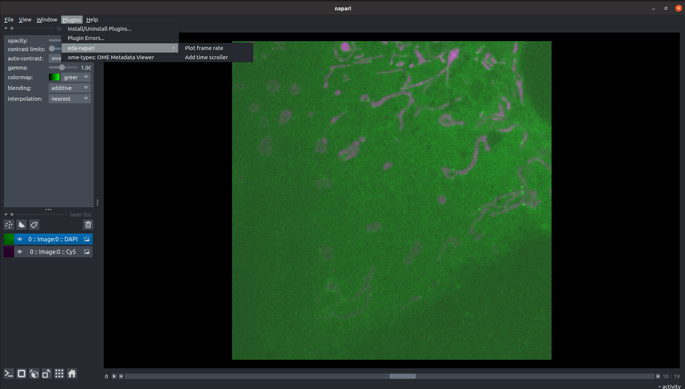

# The EDA-NAPARI plugin

## Overview

This plugin has been made in order to visualize more easy datas taken using Event Driven Acquisition (EDA).
This framework register data during interesting events at a higher frame rate than the rest of the time.
The EDA Framework is completely described in [this paper](https://www.biorxiv.org/content/10.1101/2021.10.04.463102v2).
Being the intervals between each image capture non constants in the frame-by-frame visualization of napari there is no way assess the time intervals.
This plugin reads the metadata associated to the images and offers two features that allow to locate in time the events debicted by the images.
The code of this plugin is available at [this link](https://github.com/LEB-EPFL/eda-napari).

## How to install

To install get the repository at https://github.com/LEB-EPFL/eda-napari.git in your computer
Then open it and install it through the command
```sh
pip install eda-napari
```
## How to activate it

In the napari interface, click the plugin button which is in the menubar in the high-left of the screen.
Then it should appear the eda-napari button. Clicking on it you will see the two widgets that you can apply: the frame rate widget and the time scroller widget. Click on the one that you want to use.



## Features

### Frame rate plugin

This widget reads metadata from tif files originating from microscope imaging. From a time-lapse image stack, the widget reads the capture time of each individual image. This time data is stored and the frame rate is approximated from this data.
This plugin make three plots visibles:
One of the actual elapsed time in the video against the actual frame number.
One of the frame rate as a funtion of the time elapsed.
One of the frame rate as a function of the frame number.
In all plots the actual frame number and time are pointed out by a red vertical line.


### Time scroll plugin

This widget is to animate the time-lapse linearly in time. This is useful because napari’s scroll bar animates individual frames with a constant time interval without taking into account the actual time from the metadata. In the time scroller it is also possible to modify the speed of the animation thanks to a speed up and a speed down button.